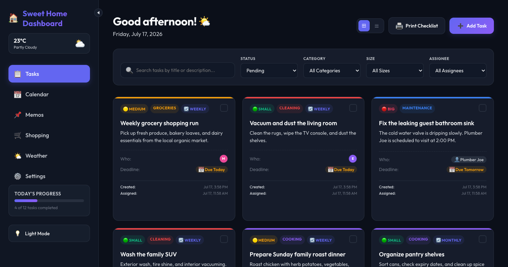

# 🏠 HomeBoard - Family Chores & Task Dashboard

HomeBoard is a lightweight, responsive, and modern dashboard application built to organize household chores, share sticky note memos, and manage family shopping lists. It runs seamlessly on desktop, tablet, and mobile devices with full light/dark theme support.



See more previews in <a href="SCREENSHOTS.md">SCREENSHOTS.md</a>.

_Built with the help of Antigravity, using Gemini 3.5 Flash._

---

## 🌟 Key Features

### 📋 Task Management

- **Flexible Sizing**: Classify chores as **Small** (green), **Medium** (amber), or **Big** (red).
- **Assignees**: Assign tasks to multiple family members, unassigned, or external names/services (e.g. plumber, guests).
- **Recurrence Engine**: Support for **weekly, bi-weekly, monthly, or quarterly** chore recurrence. When completed, next occurrence is spawned automatically with advanced deadlines in transactional operations.

### 📅 Calendar Agenda View

- **Desktop Grid**: Monthly calendar grid visualizing tasks and memos categorized by colors on deadline days.
- **Mobile Agenda**: Automatically transforms into a vertical chronological list view. Empty days are hidden dynamically using native `:has()` parent selectors.

### 📌 Memo Sticky Board

- **Visual Notes**: Fridge-board grid using colored pastel memos (8 colors available) randomly rotated for realism.
- **Calendar Deadlines**: Memos can have optional dates linking them directly into calendar days as event notifications.

### 🛒 Shared Shopping Lists (Multi-List Support)

- **Multiple Lists**: Create, name, select, and delete custom shopping lists (e.g., "Costco", "Weekly Groceries", "Home Depot"). The default list (General List) is protected and cannot be deleted.
- **Categorized Checkout**: Group items by custom **Shopping Categories** (e.g. Produce, Dairy, Bakery) or sort alphabetically.
- **Batch Operations**: Clear checked checklist items in one click specifically for the currently active list.
- **Print Ready**: Dedicated print layouts to take your checklists with you.

### 🌤️ Weather Dashboard (Multi-Location Support)

- **Multi-City Configuration**: Register and manage multiple weather locations in the weather page, and configure the OpenWeatherMap API key in Settings.
- **Home Location**: Set a specific city as the default Home location to show on the main page loads.
- **Interactive Switching**: Switch active weather forecasts instantly in the sidebar and main panel widgets.
- **5-Day Forecasts**: Fetches both current temperature/conditions and 3-hour interval 5-day forecasts via OpenWeatherMap APIs.

### 🖼️ Custom Background Wallpapers

- **Local Uploads & URL Imports**: Upload your own image file (PNG, JPG, JPEG) or specify an image URL to download, optimize, and set as the background.
- **Client-Side Canvas Optimization**: Automatically downscales high-resolution source images to `1920x1080` maximum and applies `85%` quality JPEG compression directly in the browser using HTML5 Canvas APIs, keeping images lightweight (under 200–400 KB) and saving server CPU resources.
- **Premium Glassmorphic Overlay**: Applies a subtle overlay tint (`0.3` opacity in dark mode / `0.35` in light mode) and a container backdrop blur (`blur(5px)`) to maintain perfect contrast and legibility.
- **Fixed Attachment**: Wallpaper remains fixed in the background while dashboard cards scroll smoothly on top of it.

### 📱 Responsive Mobile & Collapsible Sidebar Layouts

- **Collapsible Sidebar**: Easily collapse the main sidebar menu on desktop viewports to maximize screen space for boards.
- **Mobile Checklists & Agenda Calendar**: Automatically transforms grid layouts into clean vertical rows, simplifies calendar grids to a vertical chronological agenda, and groups search filters and actions into interactive mobile toggler buttons.

### 🔒 Access & Security Protection

- **Optional Password Authentication**: Enable username-free page locking directly from the settings panel. If enabled, the server enforces access validation and the client prompts for a passcode using a browser overlay.
- **Lock Dashboard Button**: A dedicated Lock button (🔒) appears in the sidebar footer when passcode protection is active.
- **API Rate Limiting**: Built-in rate limiting middleware protects database endpoints from automated floods.
- **Settings Masking**: Confidential keys (like the OpenWeatherMap API key or access passwords) are masked (`******`) in transit and in developer tools.

### ⚡ Performance & Optimization

- **Font Self-Hosting**: Serve the Google Font `Outfit` locally from the repository to remove external render-blocking network requests.
- **Static Assets Compression**: GZIP asset encoding (via `compression` middleware) and daily caching headers configured in the Express server.
- **Weather Proxy Caching**: Weather API requests are cached in memory for 30 minutes to stay within external API rate limits.
- **Database Indexing**: SQLite tables (tasks, members, shopping) use indexes on key query fields (completed, deadline, checked, list_id) for optimal performance.

---

## 🛠️ Technology Stack

- **Frontend**: HTML5, Vanilla ES6 Modules, custom CSS Design Tokens.
- **Backend**: Node.js, Express API server.
- **Database**: SQLite (`better-sqlite3`) with schema migrations and indexes.
- **Containerization**: Docker (alpine Linux images) with volume mounts for persistence.
- **Tooling & Styling**: ESLint for linting, Prettier for formatting.
- **Test Suite**: Jest and `supertest` for database unit tests and API integration routing tests.

---

## 📂 Project Architecture

```
homeboard/
├── src/
│   ├── config/
│   │   └── db.js            # Database setup, migrations, and seeding
│   ├── middleware/
│   │   └── auth.js          # API access protection middleware
│   └── routes/              # Express API Route Handlers
│       ├── categories.js
│       ├── members.js
│       ├── memos.js
│       ├── settings.js      # App configurations & Weather proxies
│       ├── shopping.js
│       └── tasks.js
├── public/                  # Static Frontend Client
│   ├── css/
│   │   └── style.css        # Dashboard stylesheet & self-hosted fonts
│   ├── fonts/               # Self-hosted woff2 Outfit fonts
│   ├── js/                  # ES6 Modular Frontend
│   │   ├── api.js           # AJAX API wrapper & 401 prompt redirect
│   │   ├── app.js           # Bootstrap orchestrator
│   │   ├── state.js         # Shared client state
│   │   ├── utils.js         # DOM escaping utilities
│   │   └── modules/         # Dashboard view managers (calendar, tasks, etc.)
│   └── index.html           # Single Page Layout
├── tests/
│   ├── api.test.js          # Supertest router integration tests
│   └── db.test.js           # SQLite unit database tests
├── Dockerfile               # Node.js alpine container configuration
├── docker-compose.yml       # Dev stack volumes & routing setup
├── package.json
└── server.js                # App listener entrypoint
```

---

## 🚀 Getting Started

### Docker Deployment (Recommended)

1. Clone or download the repository.
2. Build and launch the container stack:
   ```bash
   docker compose up --build -d
   ```
3. Open [http://localhost:3000](http://localhost:3000) inside your web browser.

### Local Development Setup

1. Install dependencies:
   ```bash
   npm install
   ```
2. Start the development server (runs nodemon for auto-reload):
   ```bash
   npm run dev
   ```

---

## 📡 API Reference Overview

All API endpoints are prefixed with `/api` and are rate-limited. If Access Protection is active, they require the header `x-app-password` matching your configured password.

### 🔒 Access Control

- `GET /api/settings/auth-status` - Returns authentication status: `{ enabled: boolean, authenticated: boolean }`
- `POST /api/settings/authenticate` - Verifies a password: `{ password: string }` ➡️ `{ success: boolean }`

### 📋 Task Management

- `GET /api/tasks` - Fetch all tasks
- `POST /api/tasks` - Create a task
- `PUT /api/tasks/:id` - Update details of a task
- `DELETE /api/tasks/:id` - Delete a task
- `PATCH /api/tasks/:id/toggle` - Toggle task completion status
- `GET /api/categories` - Fetch task categories
- `POST /api/categories` - Create a task category
- `PUT /api/categories/:id` - Update a task category
- `DELETE /api/categories/:id` - Delete a task category

### 👥 Family Members

- `GET /api/members` - Fetch family members
- `POST /api/members` - Create a family member (supports profile picture base64 payload)
- `PUT /api/members/:id` - Update a family member details
- `DELETE /api/members/:id` - Delete a family member

### 📌 Sticky Board Memos

- `GET /api/memos` - Fetch all sticky note memos
- `POST /api/memos` - Create a sticky board memo
- `PUT /api/memos/:id` - Update a sticky board memo
- `DELETE /api/memos/:id` - Delete a sticky board memo

### 🛒 Shopping Lists & Items

- `GET /api/shopping/lists` - Fetch all shopping lists
- `POST /api/shopping/lists` - Create a new shopping list
- `DELETE /api/shopping/lists/:id` - Delete a shopping list (protected for ID: 1)
- `GET /api/shopping?list_id=X` - Fetch all checklist items inside shopping list ID `X`
- `POST /api/shopping` - Add a checklist item inside a list (payload includes `list_id`)
- `PATCH /api/shopping/:id/toggle` - Toggle checked state of a shopping item
- `DELETE /api/shopping/:id` - Delete a shopping item
- `POST /api/shopping/clear-completed?list_id=X` - Remove all checked items inside shopping list ID `X`
- `GET /api/shopping/categories` - Fetch all shopping categories
- `POST /api/shopping/categories` - Add a shopping category
- `PUT /api/shopping/categories/:id` - Update a shopping category name
- `DELETE /api/shopping/categories/:id` - Delete a shopping category

### 🌤️ Weather Dashboard Locations

- `GET /api/weather/locations` - Fetch all configured cities
- `POST /api/weather/locations` - Add a new city
- `DELETE /api/weather/locations/:id` - Delete a city
- `PUT /api/weather/locations/:id/set-home` - Mark city ID as default home location
- `GET /api/weather?location_id=X` - Proxies weather forecast query for location ID `X` (includes 30-minute memory cache)

### ⚙️ System Settings

- `GET /api/settings` - Fetch system settings (masks API key and App Password)
- `PUT /api/settings` - Update settings (system name, tasks per page, weather API key, password credentials, background configurations)
- `GET /api/settings/background` - Fetch the active custom background wallpaper image
- `POST /api/settings/background` - Upload an optimized base64 JPEG background image
- `POST /api/settings/background/fetch-external` - Proxy secure download of a remote image URL to bypass client-side CORS constraints
- `DELETE /api/settings/background` - Remove the active custom background image from the server disk

---

## 🧪 Development Commands

- **Run Tests**: Execute the database unit tests and API integration supertests:
  ```bash
  npm test
  ```
- **Lint Check**: Run ESLint style rules checker:
  ```bash
  npm run lint
  ```
- **Code Formatter**: Format all files using Prettier standards:
  ```bash
  npm run format
  ```
